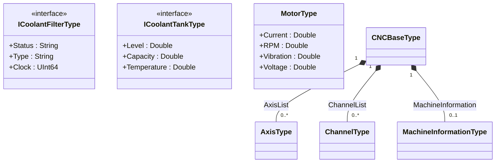

# nodeset-to-diagram

Created during CESMII's [Info Modeling](https://www.cesmii.org/technology/manufacturing-information-modeling-course/) class, during our Q&A. This quick utility converts an OPC UA NodeSet2 XML file into a [Mermaid](https://mermaid.js.org/) class diagram.

## Requirements

Python 3.10+ (standard library only — no dependencies to install).

## Usage

```sh
# Print diagram to stdout
python nodeset_to_diagram.py my.nodeset2.xml

# Write a Markdown file (auto-wraps in a ```mermaid code block)
python nodeset_to_diagram.py my.nodeset2.xml -o diagram.md

# Only include specific namespace indices
python nodeset_to_diagram.py my.nodeset2.xml --include-ns 1
```

## What it produces

Each `UAObjectType` in the nodeset becomes a class. The diagram captures:

| NodeSet construct | Diagram output |
|---|---|
| `UAVariable` child | class attribute with resolved data type |
| Abstract / interface type | `<<abstract>>` or `<<interface>>` stereotype |
| `HasSubtype` | inheritance arrow |
| `HasInterface` | dashed realization arrow |
| `HasComponent` → typed `UAObject` | composition with `"0..1"` multiplicity |
| `FolderType` + `Organizes` placeholder | composition with `"0..*"` multiplicity |
| Cross-namespace reference | `<<external>>` stub class |

By default all non-zero namespaces in the file are included. Use `--include-ns` to restrict to specific ones.

## Example

The repo includes a CNC machine profile (`cesmii.net.profiles.cnc.nodeset2.xml`) from the [CESMII Smart Manufacturing Profile Library](https://github.com/CESMII).

```sh
python nodeset_to_diagram.py cesmii.net.profiles.cnc.nodeset2.xml -o cnc-diagram.md
```

This produces a diagram covering 17 types — axes, spindles, channels, motors, tooling, and coolant system — with all composition and interface relationships.


*(abbreviated for illustration)*

## Viewing the diagram

Paste the output into any Mermaid renderer:

- [mermaid.live](https://mermaid.live) — online editor
- GitHub / GitLab — renders automatically in `.md` files
- VS Code — with the [Markdown Preview Mermaid Support](https://marketplace.visualstudio.com/items?itemName=bierner.markdown-mermaid) extension
