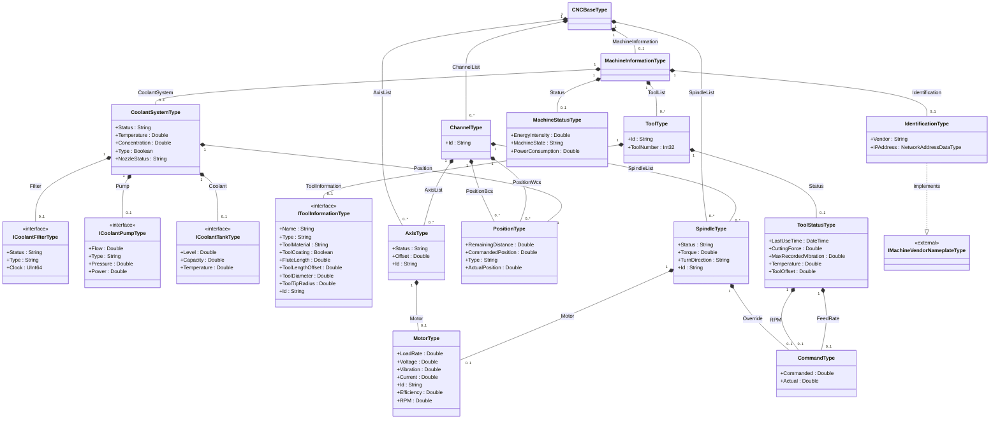

```mermaid
classDiagram
    class ICoolantFilterType {
        <<interface>>
        +Status : String
        +Type : String
        +Clock : UInt64
    }
    class ICoolantPumpType {
        <<interface>>
        +Flow : Double
        +Type : String
        +Pressure : Double
        +Power : Double
    }
    class ICoolantTankType {
        <<interface>>
        +Level : Double
        +Capacity : Double
        +Temperature : Double
    }
    class IToolInformationType {
        <<interface>>
        +Name : String
        +Type : String
        +ToolMaterial : String
        +ToolCoating : Boolean
        +FluteLength : Double
        +ToolLengthOffset : Double
        +ToolDiameter : Double
        +ToolTipRadius : Double
        +Id : String
    }
    class AxisType {
        +Status : String
        +Offset : Double
        +Id : String
    }
    class CNCBaseType {
    }
    class ChannelType {
        +Id : String
    }
    class CommandType {
        +Commanded : Double
        +Actual : Double
    }
    class CoolantSystemType {
        +Status : String
        +Temperature : Double
        +Concentration : Double
        +Type : Boolean
        +NozzleStatus : String
    }
    class IdentificationType {
        +Vendor : String
        +IPAddress : NetworkAddressDataType
    }
    class MachineInformationType {
    }
    class MachineStatusType {
        +EnergyIntensity : Double
        +MachineState : String
        +PowerConsumption : Double
    }
    class MotorType {
        +LoadRate : Double
        +Voltage : Double
        +Vibration : Double
        +Current : Double
        +Id : String
        +Efficiency : Double
        +RPM : Double
    }
    class PositionType {
        +RemainingDistance : Double
        +CommandedPosition : Double
        +Type : String
        +ActualPosition : Double
    }
    class SpindleType {
        +Status : String
        +Torque : Double
        +TurnDirection : String
        +Id : String
    }
    class ToolStatusType {
        +LastUseTime : DateTime
        +CuttingForce : Double
        +MaxRecordedVibration : Double
        +Temperature : Double
        +ToolOffset : Double
    }
    class ToolType {
        +Id : String
        +ToolNumber : Int32
    }
    class IMachineVendorNameplateType {
        <<external>>
    }

    AxisType "1" *-- "0..1" MotorType : Motor
    CNCBaseType "1" *-- "0..*" ChannelType : ChannelList
    CNCBaseType "1" *-- "0..*" SpindleType : SpindleList
    CNCBaseType "1" *-- "0..1" MachineInformationType : MachineInformation
    CNCBaseType "1" *-- "0..*" AxisType : AxisList
    ChannelType "1" *-- "0..*" PositionType : PositionBcs
    ChannelType "1" *-- "0..*" PositionType : PositionWcs
    ChannelType "1" *-- "0..*" AxisType : AxisList
    ChannelType "1" *-- "0..*" SpindleType : SpindleList
    CoolantSystemType "1" *-- "0..1" ICoolantTankType : Coolant
    CoolantSystemType "1" *-- "0..1" ICoolantPumpType : Pump
    CoolantSystemType "1" *-- "0..1" ICoolantFilterType : Filter
    CoolantSystemType "1" *-- "0..1" PositionType : Position
    IdentificationType ..|> IMachineVendorNameplateType : implements
    MachineInformationType "1" *-- "0..1" IdentificationType : Identification
    MachineInformationType "1" *-- "0..1" MachineStatusType : Status
    MachineInformationType "1" *-- "0..*" ToolType : ToolList
    MachineInformationType "1" *-- "0..1" CoolantSystemType : CoolantSystem
    SpindleType "1" *-- "0..1" CommandType : Override
    SpindleType "1" *-- "0..1" MotorType : Motor
    ToolStatusType "1" *-- "0..1" CommandType : RPM
    ToolStatusType "1" *-- "0..1" CommandType : FeedRate
    ToolType "1" *-- "0..1" IToolInformationType : ToolInformation
    ToolType "1" *-- "0..1" ToolStatusType : Status
```
